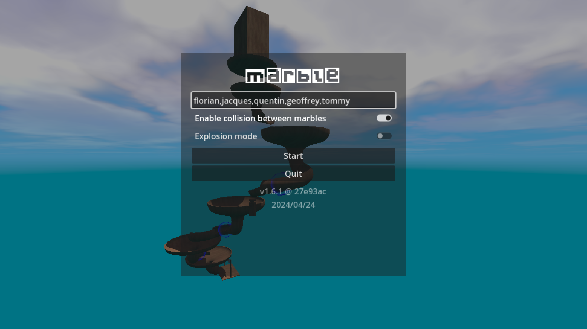
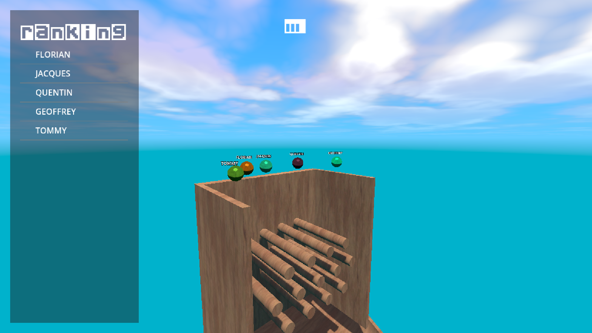
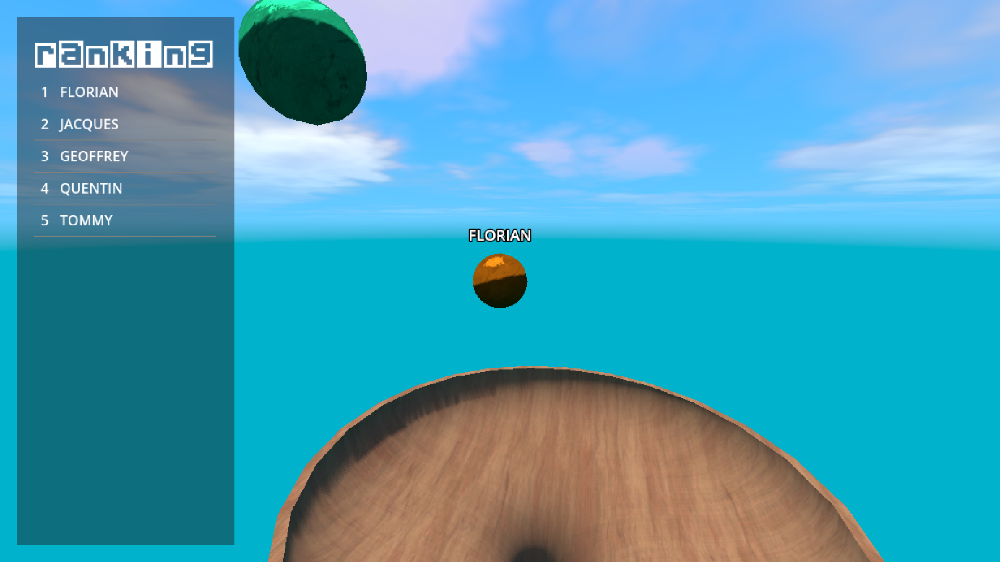

# ⚽ Marble

  

A marble race minigame, made with [Godot Engine](https://godotengine.org/).

## About

Marble is an open source mini-game about marble racing.

### Controls

- `WASD` to move.
- `Mouse` to move the camera around.
- `Tab` to follow a marble.
- `ESC` to open and close pause menu.

### Features

- Name your marbles.
- Start procedural races.
- Watch the real-time ranking.

### Screenshots

     

## Contributing

We welcome community contributions to this project.

Please read our [Contributor Guide](CONTRIBUTING.md) for more information on how to get started.
